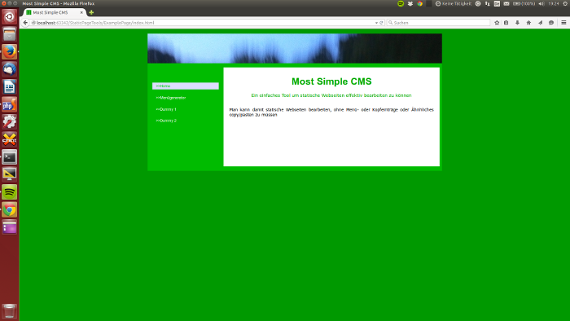
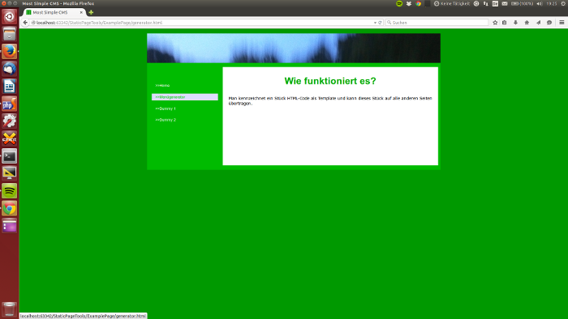

# MostSimpleCMS
## What is it good for?
If you have a simple Homepage with, let's say, 4 subpages, then often even a lightweight CMS is too much.
The most convenient thing is a classic static page where you edit the HTML dircectly.

But the drawback of this approach is: You have to copy/paste the menu, the header, the footer, etc. from one page to
all the others. And if you have to change something you have to do it again and again.

This problem is solved by the MostSimpleCMS. (Formerly frames where a popular solution. But frames have many drawbacks,
so almost nobody uses them anymore.)

## How does it work?
Most Simple CMS knows *Templates* and *Placeholders*.

1. Mark a piece of HTML code or some pieces of code as template(s).

   To turn a piece of HTML of your page into a template you have to enclose it with the following markers:

   `<!-- Template Begin <name of the template> -->`

   `<!-- Template End  <name of the template> -->`

   (Replace `<name of the template>` with a name consisting of letters and digits. For instance '1' or 'Header' are valid
        names.)

2. Mark the places in your HTML which should be replaced by the template as placeholders.

   To turn a place in your HTML into a placeholder you have to enclose it with the following markers:

   `<!-- Placeholder Begin <name of the template which should included here> -->`

   `<!-- Placeholder End  <name of the template which should included here> -->`

   (Replace `<name of the template which should included here>` with the name of the corresponding template.)

   It doesn't matter
   whether the place between the placeholder markers is empty or not. The script places the template between these
   two markers
   replacing all code which was there before.

3. Copy `mostsimplecms.phar` into the directory of your page and let it run with:

   `php mostsimplecms.phar`

   The PHP Command Line Interface (php cli) has to be installed and accessible for this. If this isn't the case on your
   Webhost, you have to install php cli on your local machine, edit the page there and upload it when ready.

   In case you want intelligent copying (this is explained below) call:

   `php mostsimplecms.phar -m`

4. It's done. The changes which you have done in your templates are spread into all placeholders.

## Example Page
The Subdirectory `ExamplePage` of this repo contains a simple webpage with some templates and placeholders to play
around with.

## Intelligent Copying
Let's assume your menu looks like this on the first page:

and like this on the second page:

Then simply copying the menu from one page to the other pages isn't enough and you have to invoke inelligent copying by
using the command line parameter -m

   `php mostsimplecms.phar -m`
